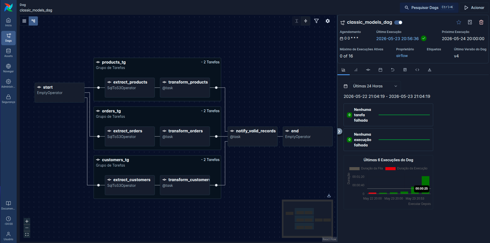

   
      
   

# Airflow Study Project — Classic Models ETL

This repository is a hands-on study project to learn and practice Apache Airflow fundamentals and good practices using a small end-to-end ETL pipeline.

The project orchestrates:

- Extracting tables from a MySQL database (schema `classicmodels`)
- Landing raw data in Amazon S3 ("bronze")
- Cleaning/validating the data with pandas
- Writing trusted outputs back to S3 ("silver")
- Exchanging metadata between tasks using XCom

## What I used (Airflow features)

- **DAG authoring (Airflow 3 / `airflow.sdk`)**: decorators for `@dag` and `@task`
- **TaskFlow API**: Python tasks for transformation and notification
- **TaskGroup**: one group per table (customers / orders / products)
- **Airflow Variables**: dynamic configuration (S3 bucket name)
- **Airflow Connections**: decoupled credentials/endpoints for MySQL and AWS
- **XCom**: push/pull the number of valid records per table
- **Branching**: conditional paths in the DAG (`@task.branch` / `BranchPythonOperator`)
- **Providers / Operators**: `SqlToS3Operator` (Amazon provider) for extraction

## Project structure

- `dags/`
   - `classic_models_dag.py`: main DAG definition
- `src/pipeline/`
   - `classic_models_pipeline.py`: TaskFlow tasks (`transform_data`, `notify_valid_records`)
- `src/etl/`
   - `transform.py`: transformation helpers (drop nulls, remove duplicates)
- `config/airflow.cfg`: Airflow configuration mounted into the containers
- `docker-compose.yaml` + `Dockerfile`: local Airflow stack (CeleryExecutor + Redis + Postgres)

## DAG overview

The DAG `classic_models_dag` runs daily and follows this flow:

### DAG screenshot

1. `start`
2. For each table in `[customers, orders, products]`:
   - `extract_<table>`: exports `SELECT * FROM classicmodels.<table>` to S3 as CSV in the **bronze** layer
   - `transform_<table>`: reads the CSV from S3, cleans it, writes the result to **silver**, and pushes the number of valid rows to XCom
3. `notify_valid_records`: pulls the XComs from each transform task and logs the counts
4. `end`

S3 keys are partitioned by execution date (based on `ds`), e.g.:

- `bronze/customers/2026/05/23/customers_data.csv`
- `silver/customers/2026/05/23/customers_data.csv`

## Prerequisites

- Docker + Docker Compose
- AWS credentials (or an S3-compatible endpoint) configured in an Airflow Connection
- A MySQL database reachable from the Airflow containers with the `classicmodels` schema

## Running locally (Docker Compose)

1. Create an `.env` file (not committed) with at least a Fernet key (and optionally your Airflow UID on Linux):
   - `FERNET_KEY=<your_fernet_key>`
   - `AIRFLOW_UID=$(id -u)` (recommended on Linux)

2. Build and start the stack:
   - `docker compose up --build`

3. Open the UI:
   - http://localhost:8080
   - Default user/pass (unless overridden by env): `airflow` / `airflow`

## Airflow configuration you must set

### Variable

Create an Airflow Variable:

- `s3_raw_data_bucket`: the bucket name where data will be written

### Connections

Create these Airflow Connections (names must match the code):

- `classicmodels_mysql_conn`
   - Type: MySQL
   - Host/User/Password/Schema as needed to access `classicmodels`

- `aws_default_conn`
   - Type: Amazon Web Services
   - Configure credentials and region (or IAM role in the container environment)

## Data quality / transformation logic

The transformation step performs simple but explicit checks:

- Drop null values (`dropna`)
- Remove duplicated rows (`drop_duplicates`)
- Assertions ensure the DataFrame is not empty and that the cleaning rules were applied

This is intentionally simple: the goal is to practice orchestration patterns (inputs/outputs, idempotency, and observability), not sophisticated data modeling.

## What I learned

- How to structure a real DAG with **TaskGroups** to keep the graph readable and scalable as the number of entities grows.
- How to separate **configuration from code** using Airflow **Variables** and **Connections** (and why hard-coding secrets is a bad idea).
- How the **TaskFlow API** improves readability and testability compared to monolithic operator-only DAGs.
- How to use **XCom** intentionally to pass _small metadata_ (record counts), not large datasets.
- How to implement **branches** (conditional paths) and handle `skipped` tasks using `trigger_rule`.
- How to think in terms of **data layers** (bronze/silver) and partitioning by execution date (`ds`).
- The importance of **idempotent tasks** (e.g., writing outputs with `replace=True`) to make backfills and retries safer.

## Branching (branches) in Airflow

Branching is the pattern where a task decides which downstream path(s) should run.

### TaskFlow API (`@task.branch`)

- A `@task.branch` function must return the **`task_id`** (string) of the next task to run (or a list of task IDs).
- Non-selected downstream tasks are automatically marked as **`skipped`** for that DAG run.
- When you need to “join” after a branch, use a task with a permissive trigger rule such as:
   - `trigger_rule="none_failed_min_one_success"`

Example DAG: `dags/branch_operator_taskflow_api_dag.py`.

**Note about the Graph view:**
If you pass outputs between tasks as function arguments (TaskFlow style), the UI may show direct dependencies like
`extract_data -> print_case_less_half` in addition to the branch links. This is normal: Airflow is visualizing both the
control-flow dependency (branch) and the data dependency (XComArg input).

### Traditional approach (operators)

The classic (pre-TaskFlow) approach uses:

- `PythonOperator` for Python callables
- `BranchPythonOperator` to choose the next `task_id`
- XCom explicitly via `ti.xcom_push()` / `ti.xcom_pull()`

Example DAG: `dags/branch_operator_traditional_dag.py`.
